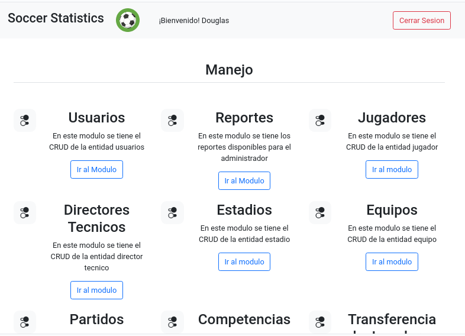
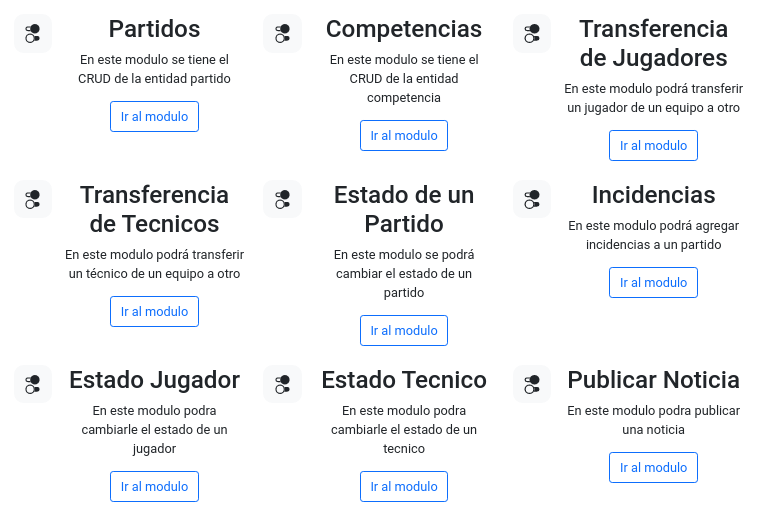
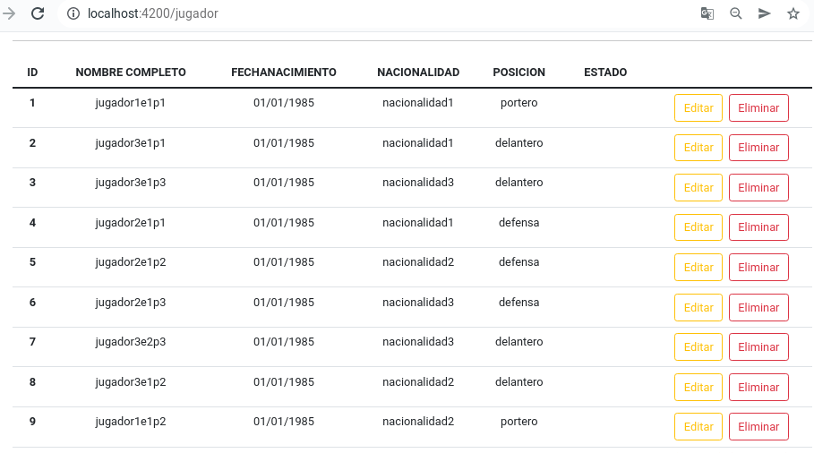
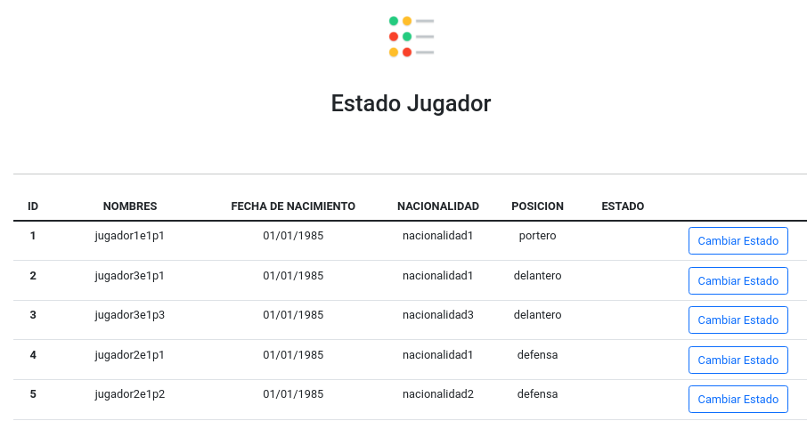
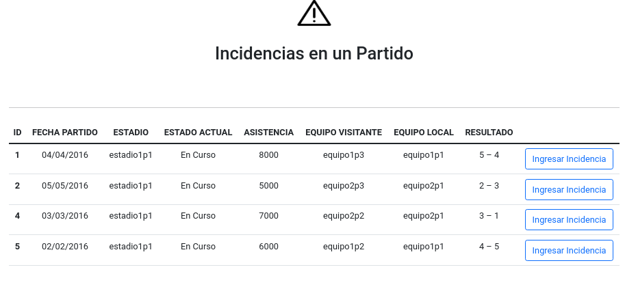
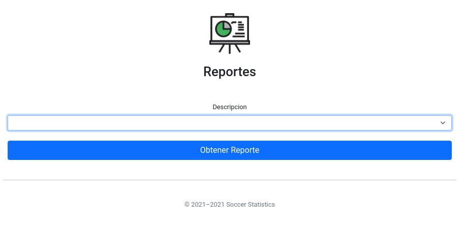

# REST-API Angular, Node.js y Oracle

_Este es un proyecto universitario del curso de Manejo e Implementacion de Archivos en donde la idea principal es crear una REST-API con Node.js y Angular ademas de practicar el manejo de base de datos con Oracle e implementar el REST-API a una aplicacion movil utilizando Ionic._

## 🚀 Comenzando

### Requerimientos

* Nodejs 16.13.1 ó superior.   [Instalar Nodejs](https://github.com/nodesource/distributions/blob/master/README.md)
```console
~$ node --version
```

* Angular CLI: 13.0.3 ó superior [Instalar Angular](https://cli.angular.io/)
```console
~$ ng version
```

* Oracle 18c ó superior
    

### Instalacion de Oracle

La instalación de Node.js y Angular es relativamente facil sin embargo la instalación de Oracle es un poco más trabajosa una de las formas menos complejas de implementarlo es por medio de Docker el cual este será el metodo a utilizar.

* Se deberá de instalar docker
```console
~$ docker version
```

* Se deberá instalar Oracle SQL Developer, esto es con el fin de facilitar el uso de Oracle

* Ahora se descarga una imagen de Oracle en este caso se utiliza la imagen proporcionada por el usuario **ynraju4**
```console
~$ docker pull ynraju4/oracle18c
```

* Se crea un containter de la imagen descargada
```console
~$ docker run --name oracle_soch \
    -d \
    -p 1521:1521 \
    -e ORACLE_PWD=psw123 \
    -e ORACLE_CHARACTERSET=AL32UTF8 \
    ynraju4/oracle18c
```

* Se verifica que se halla creado correctamente el container
```console
~$ docker logs -f 'CONTAINER ID'
```

* Ahora realizamos la conexion del container en el SQL Developer
```
Name: 'Cualquier Nombre' en mi caso escribi 'Oracle Docker'
Usuario: SYS
Contraseña: psw123
Nombre del Host: localhost
Puerto: 1521
SID: ORCLCDB
```

* Si se ha hecho correctamente lo anterior se debe de retornar la versión de Oracle instalado
```sql
    SELECT * FROM v$version WHERE banner LIKE 'Oracle%';
```
### Levantando el proyecto

* Instalar las dependencias del Backend y Frontend
```console
~$ npm install 
```
* Levantar el Backend (estar dentro de la carpeta de Backend)
```console
~$ node /src/index.js 
```
* (En el caso que se tenga un error en el instantclient)
```console
~$ export LD_LIBRARY_PATH=/opt/instantclient_21_4/
```
* Levantar el Frontend (estar dentro de la carpeta de Frontend)
```console
~$  ng serve --open 
```

## Arquitectura


## Diagrama Entidad-Relacion

## Routes

* pais 
* usuario
* jugador
* equipo
* tecnico
* partido
* estadio
* membresia
* competencias
* noticias
* trayectoria_jugador
* trayectoria_tecnico
* reportes_admin
* reportes_usuarios

## Detalle de un CRUD de endpoint

* "http://localhost:3000/getEquipos": Metodo get para obtener del servidor toda la informacion relacionada con el equipo
* "http://localhost:3000//addEquipo":  Metodo post para agregar un nuevo equipo a la tabla. previo a realizar esta agregacion verifica que no exista duplicidad.
* "http://localhost:3000//updateEquipo" Metodo put para modificar valores en los datos del equipo 
* "http://localhost:3000//deleteEquipo/:id_equipo"  Metodo delete para eliminar los datos de una tabla. Este metodo elimina permanentemente el registro 

**EJEMPLO DE ARCHIVO DE ENTRADA .csv**

```
nombre,fecha_fun,pais
Manchester City F.C.,16/04/1880,Inglaterra
Chelsea F.C.,10/03/1905,Inglaterra
Tottenham Hotspur,05/09/1882,Inglaterra
Liverpool F.C.,03/06/1892,Inglaterra
Manchester United F.C.,05/03/1878,Inglaterra
Arsenal F.C.,01/12/1886,Inglaterra
Everton F.C.,01/01/1878,Inglaterra
Bayern de Múnich,27/02/1900,Alemania
Borussia Dortmund,19/12/1909,Alemania
Bayer 04 Leverkusen,01/07/1904,Alemania
R.B. Leipzig,19/05/2009,Alemania
Borussia Mönchengladbach,01/08/1900,Alemania
Lille O.S.C.,23/09/1944,Francia
Olympique de Lyon,03/08/1950,Francia
Olympique de Marsella,31/08/1899,Francia
A.S. Mónaco F.C.,23/08/1924,Francia
Paris-Saint-Germain F.C.,12/08/1970,Francia
F.C. Barcelona,29/11/1899,España
Real Madrid C.F.,06/03/1902,España
Atlético de Madrid,26/04/1903,España
Sevilla F.C.,25/01/1890,España
Villarreal C.F.,10/03/1923,España
Valencia C.F.,18/03/1919,España
A.C. Milan,16/12/1899,Italia
Inter de Milán,09/03/1908,Italia
Juventus,01/11/1897,Italia
A.S. Roma,07/06/1927,Italia
S.S.C. Napoli,01/08/1926,Italia

```

## Stored Procedures
``` sql
CREATE OR REPLACE PROCEDURE AGREGAR_BITACORA (descripcion_usu VARCHAR2, operacion_usu VARCHAR2, id_usu INTEGER) is
BEGIN
INSERT INTO BITACORA (DESCRIPCION, OPERACION, ID_USUARIO) VALUES(descripcion_usu, operacion_usu, id_usu);
END;
/
CREATE OR REPLACE PROCEDURE ACTUALIZAR_CONTRASENIA (correo_usu VARCHAR2, token VARCHAR2) is
BEGIN
UPDATE USUARIO SET CLAVE = token WHERE CORREO = correo_usu;
END;
```

## Listado de Modulos

#### Modulo de Login

Para ingresar a la aplicacion web, cada usuario debe colocar su correo electronico y su respectiva clave de acceso.

#### Modulo de Usuarios

Todos los usuarios deben estar registrados para poder ingresar al sistema y hay diferentes tipos de usuarios al momento de ingresar.

#### Modulo de Jugador

En este modulo se ingresa la informacion personal  del jugador asi como su trayectoria en su vida deportiva.

#### Modulo de Tecnico

En este modulo se ingresa la informacion personal del tecnico asi como su trayectoria profesional en el cuerpo tecnico.

#### Modulo de Estadios

En este modulo se puede ingresar el historial de un estadio asi como sus caracteristica.

#### Modulo de Equipos

En este modulo se ingresara los datos relacionados con los equipos asi como la fecha de su fundacion

#### Modulo de Partidos

Modulo que gestionara el historial y resultados de los partidos, cada equipo involucrado debe existir previamente.

#### Modulo de Transferencia de Jugadores

En este modulo se podra transferir un jugador de un equipo a otro y se actualiza la trayectoria del jugador.

#### Modulo de Transferencia de Tecnicos

En este modulo se podra tranferir un miembro del cuerpo tecnico a otro equipo y se actualizadra la trayectoria del ejecutivo tecnico.


#### Modulo de Incidencias

Este modulo lleva un historial de las incidencias ocurridas durante un encuentro entre dos equipos.

#### Modulo de Estado Jugador

Para configurar el estado del jugador, por ejemplo si esta suspendido, activo y no activo.

#### Modulo de Estado Tecnico

Para configurar el estado del tecnico, por ejemplo si esta suspendido, activo y no activo.

#### Modulo de Publicar Noticia

Los usuarios podrán filtrar las noticias si están relacionadas solo con sus equipos favoritos o si las quiere ver TODAS en general y deberá mostrar la noticia completamente detallada.

## Interfaz Grafica
**MODULO DE LOGIN** 


**LISTADO DE MODULOS PARTE 1** 



**LISTADO DE MODULOS PARTE 2** 



**LISTADO DE JUGADORES** 



**LISTADO DE ESTADO DE JUGADORES** 



**LISTADO INCIDENCIAS ENTRE PARTIDOS** 



**MODULO DE USUARIOS** 


**MODULO DE ESTADIOS** 


**MODULO DE COMPETENCIA** 


**MODULO DE TRANSFERENCIA DE JUGADOR** 


**MODULO DE ESTADO DE TECNICO** 


**MODULO PUBLICAR NOTICIAS**


**MODULO DE ESTADO DE REPORTES PARA UN USUARIO ADMINISTRADOR** 


