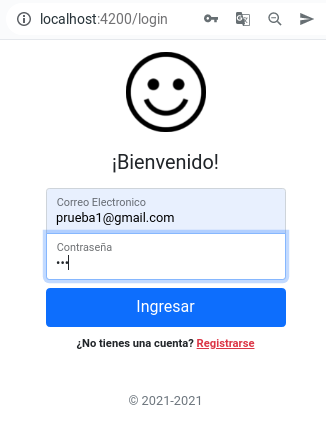
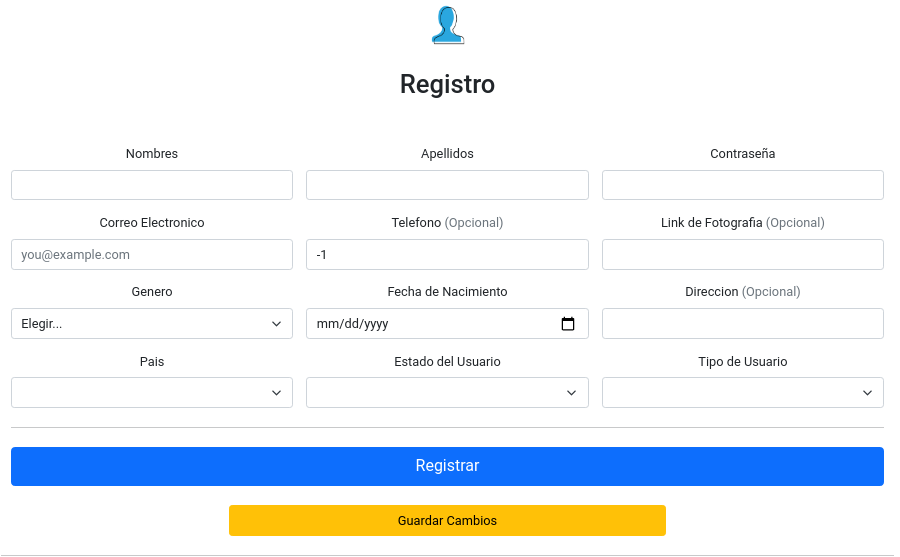
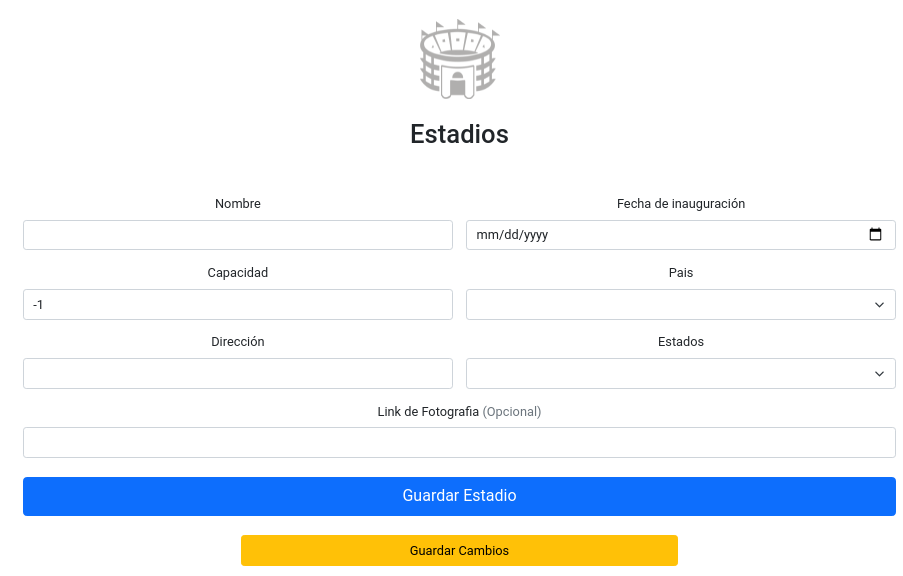
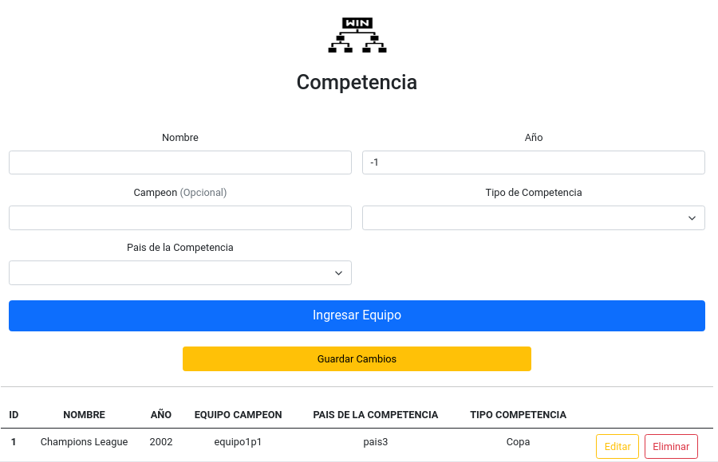
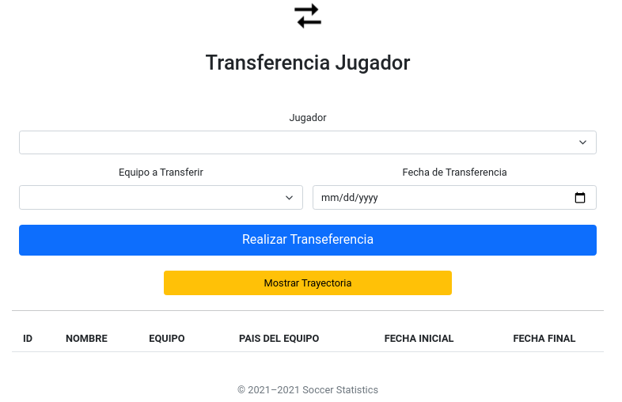
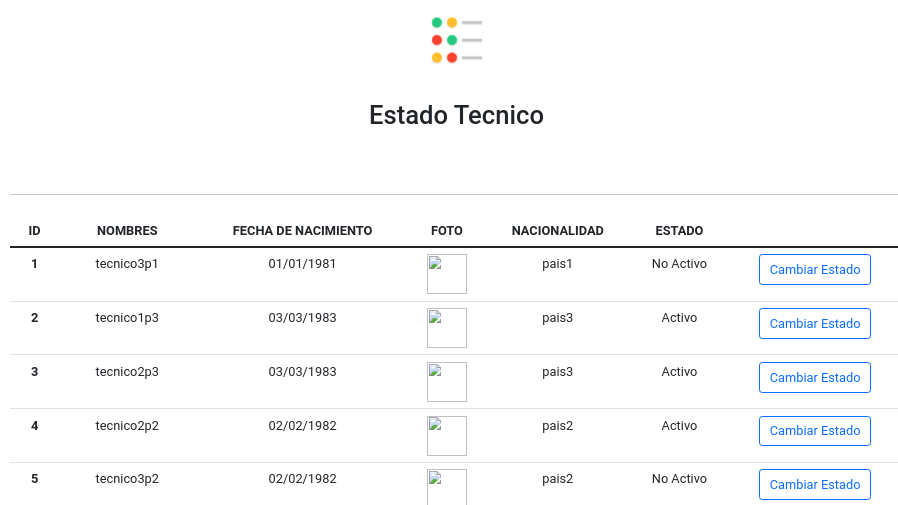
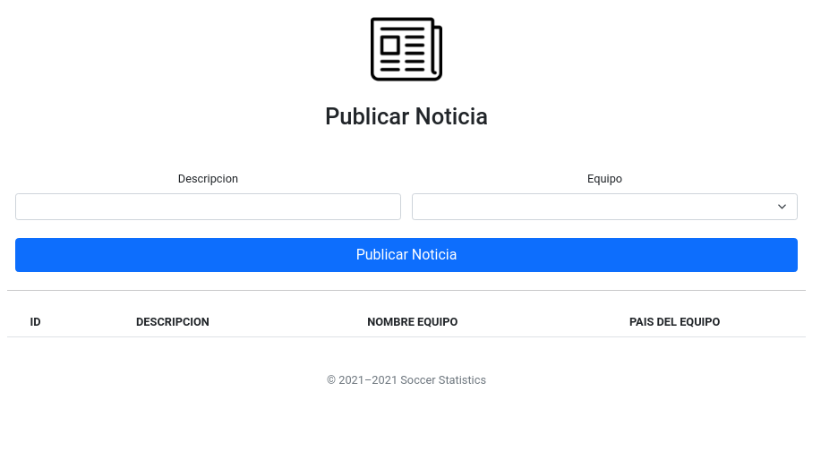

# REST-API Angular, Node.js y Oracle

_Este es un proyecto universitario del curso de Manejo e Implementacion de Archivos en donde la idea principal es crear una REST-API con Node.js y Angular ademas de practicar el manejo de base de datos con Oracle e implementar el REST-API a una aplicacion movil utilizando Ionic._

## 🚀 Comenzando

### Requerimientos

* Nodejs 16.13.1 ó superior.   [Instalar Nodejs](https://github.com/nodesource/distributions/blob/master/README.md)
```console
~$ node --version
```

* Angular CLI: 13.0.3 ó superior [Instalar Angular](https://cli.angular.io/)
```console
~$ ng version
```

* Oracle 18c ó superior
    

### Instalacion de Oracle

La instalación de Node.js y Angular es relativamente facil sin embargo la instalación de Oracle es un poco más trabajosa una de las formas menos complejas de implementarlo es por medio de Docker el cual este será el metodo a utilizar.

* Se deberá de instalar docker
```console
~$ docker version
```

* Se deberá instalar Oracle SQL Developer, esto es con el fin de facilitar el uso de Oracle

* Ahora se descarga una imagen de Oracle en este caso se utiliza la imagen proporcionada por el usuario **ynraju4**
```console
~$ docker pull ynraju4/oracle18c
```

* Se crea un containter de la imagen descargada
```console
~$ docker run --name oracle_soch \
    -d \
    -p 1521:1521 \
    -e ORACLE_PWD=psw123 \
    -e ORACLE_CHARACTERSET=AL32UTF8 \
    ynraju4/oracle18c
```

* Se verifica que se halla creado correctamente el container
```console
~$ docker logs -f 'CONTAINER ID'
```

* Ahora realizamos la conexion del container en el SQL Developer
```
Name: 'Cualquier Nombre' en mi caso escribi 'Oracle Docker'
Usuario: SYS
Contraseña: psw123
Nombre del Host: localhost
Puerto: 1521
SID: ORCLCDB
```

* Si se ha hecho correctamente lo anterior se debe de retornar la versión de Oracle instalado
```sql
    SELECT * FROM v$version WHERE banner LIKE 'Oracle%';
```
---

## Comandos UTiles 

* para instalar las dependencias del backend y frontend
```console
~$ npm install 
```
* para levantar el backend (estar dentro de la carpeta de backend)
```console
~$  node /src/index.js 
```

* para levantar el frontend (estar dentro de la carpeta de frontend )
```console
~$  ng serve --open 
```

---

## Arquitectura

---

## Diagrama Entidad-Relacion

---

## Endpoints

* pais 
* usuario
* jugador
* equipo
* tecnico
* partido
* estadio
* membresia
* competencias
* noticias
* trayectoria_jugador
* trayectoria_tecnico
* reportes_admin
* reportes_usuarios

---

## Detalle de un CRUD de endpoint

* "http://localhost:3000/getEquipos": metodo get para obtener del servidor toda la informacion relacionada con el equipo
* "http://localhost:3000//addEquipo":  metodo post para agregar un nuevo equipo a la tabla. previo a realizar esta agregacion verifica que no exista duplicidad.
* "http://localhost:3000//updateEquipo" metodo put para modificar valores en los datos del equipo 
* "http://localhost:3000//deleteEquipo/:id_equipo"  metodo delete para eliminar los datos de una tabla. este metodo elimina permanentemente el registro 


## Storeds Procedures

---
## Listado de Modulos

* Modulo de Login
* Modulo de Usuarios
* Modulo de Jugador
* Modulo de Tecnico
* Modulo de Estadios
* Modulo de Equipos
* Modulo de Partidos
* Modulo de competencias
* Modulo de Transferencia de Jugadores
* Modulo de Transferencia de Tecnicos
* Modulo de Estado de un partido
* Modulo de Incidencias
* Modulo de Estado Jugador
* Modulo de Estado Tecnico
* Modulo de Publicar Noticia

---
presentacion del **MODULO DE LOGIN** 



---
ejemplo de  **MODULO DE USUARIOS** 



---
ejemplo de  **MODULO DE ESTADIOS** 



---
ejemplo de  **MODULO DE COMPETENCIA** 




ejemplo de  **MODULO DE TRANSFERENCIA DE JUGADOR** 




ejemplo de  **MODULO DE ESTADO DE TECNICO** 




ejemplo de  **MODULO DE ESTADO DE PUBLICAR NOTICIAS** 




